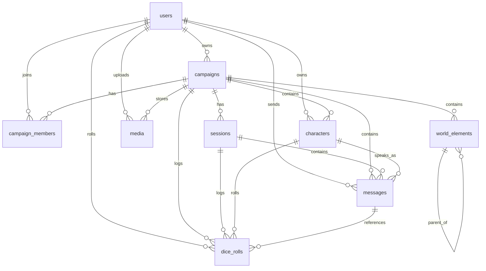

# Dungeon Master AI - Database Schema

> **Status:** Design Phase  
> **Author:** Forge 🔧  
> **Date:** 2026-02-09  
> **Database:** PostgreSQL 15+

## Overview

This schema supports a D&D/RPG game master AI assistant with:
- Multi-tenant user system (players & GMs)
- Campaign management with flexible world-building
- Character sheets with JSONB for system-agnostic stats
- Session tracking with AI conversation history
- Extensible world elements (locations, items, monsters, etc.)

## Design Principles

1. **UUIDs everywhere** - No sequential IDs exposed
2. **Soft deletes** - `deleted_at` timestamp instead of hard deletes
3. **JSONB for flexibility** - D&D/RPG systems vary wildly; JSONB handles variable stats
4. **Audit timestamps** - `created_at`, `updated_at` on all tables
5. **System-agnostic** - Works for D&D 5e, Pathfinder, homebrew, etc.

---

## Schema

### Extensions

```sql
CREATE EXTENSION IF NOT EXISTS "uuid-ossp";
CREATE EXTENSION IF NOT EXISTS "pgcrypto";
```

---

### 1. Users

Players and Game Masters.

```sql
CREATE TABLE users (
    id              UUID PRIMARY KEY DEFAULT uuid_generate_v4(),
    email           VARCHAR(255) NOT NULL UNIQUE,
    username        VARCHAR(50) NOT NULL UNIQUE,
    display_name    VARCHAR(100),
    password_hash   VARCHAR(255) NOT NULL,
    avatar_url      TEXT,
    
    -- Preferences stored as JSONB for flexibility
    preferences     JSONB DEFAULT '{}',
    -- Example: {"theme": "dark", "dice_style": "3d", "language": "es"}
    
    email_verified_at TIMESTAMPTZ,
    last_login_at   TIMESTAMPTZ,
    created_at      TIMESTAMPTZ NOT NULL DEFAULT NOW(),
    updated_at      TIMESTAMPTZ NOT NULL DEFAULT NOW(),
    deleted_at      TIMESTAMPTZ
);

CREATE INDEX idx_users_email ON users(email) WHERE deleted_at IS NULL;
CREATE INDEX idx_users_username ON users(username) WHERE deleted_at IS NULL;
```

---

### 2. Campaigns

Game campaigns/adventures with world settings.

```sql
CREATE TABLE campaigns (
    id              UUID PRIMARY KEY DEFAULT uuid_generate_v4(),
    owner_id        UUID NOT NULL REFERENCES users(id),
    
    name            VARCHAR(255) NOT NULL,
    slug            VARCHAR(100),
    description     TEXT,
    cover_image_url TEXT,
    
    -- Game system info
    game_system     VARCHAR(50) NOT NULL DEFAULT 'dnd5e',
    -- Options: 'dnd5e', 'pathfinder2e', 'callofcthulhu', 'homebrew', etc.
    
    -- World/Setting info as JSONB
    world_info      JSONB DEFAULT '{}',
    -- Example: {
    --   "name": "Forgotten Realms",
    --   "year": 1492,
    --   "calendar": "Dale Reckoning",
    --   "deities": [...],
    --   "house_rules": [...]
    -- }
    
    -- Campaign state
    status          VARCHAR(20) NOT NULL DEFAULT 'active',
    -- Options: 'planning', 'active', 'paused', 'completed', 'archived'
    
    -- AI Settings per campaign
    ai_settings     JSONB DEFAULT '{}',
    -- Example: {
    --   "tone": "grimdark",
    --   "difficulty": "hard",
    --   "narration_style": "descriptive",
    --   "homebrew_allowed": true
    -- }
    
    started_at      TIMESTAMPTZ,
    completed_at    TIMESTAMPTZ,
    created_at      TIMESTAMPTZ NOT NULL DEFAULT NOW(),
    updated_at      TIMESTAMPTZ NOT NULL DEFAULT NOW(),
    deleted_at      TIMESTAMPTZ
);

CREATE INDEX idx_campaigns_owner ON campaigns(owner_id) WHERE deleted_at IS NULL;
CREATE INDEX idx_campaigns_status ON campaigns(status) WHERE deleted_at IS NULL;
CREATE INDEX idx_campaigns_slug ON campaigns(slug) WHERE deleted_at IS NULL;
```

---

### 3. Campaign Members

Links users to campaigns with roles.

```sql
CREATE TABLE campaign_members (
    id              UUID PRIMARY KEY DEFAULT uuid_generate_v4(),
    campaign_id     UUID NOT NULL REFERENCES campaigns(id) ON DELETE CASCADE,
    user_id         UUID NOT NULL REFERENCES users(id),
    
    role            VARCHAR(20) NOT NULL DEFAULT 'player',
    -- Options: 'gm', 'co_gm', 'player', 'spectator'
    
    nickname        VARCHAR(50),  -- In-campaign display name
    joined_at       TIMESTAMPTZ NOT NULL DEFAULT NOW(),
    left_at         TIMESTAMPTZ,
    
    -- Member-specific settings
    settings        JSONB DEFAULT '{}',
    
    created_at      TIMESTAMPTZ NOT NULL DEFAULT NOW(),
    updated_at      TIMESTAMPTZ NOT NULL DEFAULT NOW(),
    
    UNIQUE(campaign_id, user_id)
);

CREATE INDEX idx_campaign_members_campaign ON campaign_members(campaign_id);
CREATE INDEX idx_campaign_members_user ON campaign_members(user_id);
```

---

### 4. Characters

Player characters and NPCs.

```sql
CREATE TABLE characters (
    id              UUID PRIMARY KEY DEFAULT uuid_generate_v4(),
    campaign_id     UUID NOT NULL REFERENCES campaigns(id) ON DELETE CASCADE,
    owner_id        UUID REFERENCES users(id),  -- NULL for NPCs controlled by GM/AI
    
    name            VARCHAR(100) NOT NULL,
    character_type  VARCHAR(20) NOT NULL DEFAULT 'pc',
    -- Options: 'pc' (player character), 'npc', 'companion', 'villain', 'monster'
    
    -- Basic info
    race            VARCHAR(50),
    class           VARCHAR(100),  -- Can be multiclass: "Fighter 5 / Wizard 3"
    level           INTEGER DEFAULT 1,
    background      VARCHAR(50),
    alignment       VARCHAR(20),
    
    -- Portrait/token
    avatar_url      TEXT,
    token_url       TEXT,
    
    -- Stats as JSONB (system-agnostic)
    stats           JSONB DEFAULT '{}',
    -- D&D 5e example: {
    --   "abilities": {"str": 16, "dex": 14, "con": 15, "int": 10, "wis": 12, "cha": 8},
    --   "hp": {"current": 45, "max": 52, "temp": 0},
    --   "ac": 18,
    --   "speed": {"walk": 30, "swim": 15},
    --   "proficiency_bonus": 3,
    --   "saving_throws": ["str", "con"],
    --   "skills": {"athletics": 6, "intimidation": 2},
    --   "resistances": ["fire"],
    --   "conditions": ["poisoned"]
    -- }
    
    -- Inventory as JSONB
    inventory       JSONB DEFAULT '[]',
    -- Example: [
    --   {"name": "Longsword +1", "quantity": 1, "equipped": true, "type": "weapon"},
    --   {"name": "Gold pieces", "quantity": 150, "type": "currency"},
    --   {"name": "Potion of Healing", "quantity": 3, "type": "consumable"}
    -- ]
    
    -- Spells/abilities as JSONB
    abilities       JSONB DEFAULT '{}',
    -- Example: {
    --   "spell_slots": {"1": 4, "2": 3, "3": 2},
    --   "spells_known": ["fireball", "shield", "magic_missile"],
    --   "class_features": ["action_surge", "second_wind"],
    --   "feats": ["great_weapon_master"]
    -- }
    
    -- Character backstory and notes
    backstory       TEXT,
    personality     TEXT,
    notes           TEXT,
    
    -- For NPCs: AI behavior hints
    ai_behavior     JSONB DEFAULT '{}',
    -- Example: {"hostility": "friendly", "knowledge": ["local_history"], "speech_pattern": "formal"}
    
    is_active       BOOLEAN DEFAULT TRUE,  -- For tracking dead/retired characters
    died_at         TIMESTAMPTZ,
    
    created_at      TIMESTAMPTZ NOT NULL DEFAULT NOW(),
    updated_at      TIMESTAMPTZ NOT NULL DEFAULT NOW(),
    deleted_at      TIMESTAMPTZ
);

CREATE INDEX idx_characters_campaign ON characters(campaign_id) WHERE deleted_at IS NULL;
CREATE INDEX idx_characters_owner ON characters(owner_id) WHERE deleted_at IS NULL;
CREATE INDEX idx_characters_type ON characters(character_type) WHERE deleted_at IS NULL;
CREATE INDEX idx_characters_active ON characters(campaign_id, is_active) WHERE deleted_at IS NULL;
```

---

### 5. Sessions

Play sessions with timestamps and notes.

```sql
CREATE TABLE sessions (
    id              UUID PRIMARY KEY DEFAULT uuid_generate_v4(),
    campaign_id     UUID NOT NULL REFERENCES campaigns(id) ON DELETE CASCADE,
    
    session_number  INTEGER NOT NULL,
    title           VARCHAR(255),
    
    -- Timing
    scheduled_at    TIMESTAMPTZ,
    started_at      TIMESTAMPTZ,
    ended_at        TIMESTAMPTZ,
    duration_minutes INTEGER,
    
    -- Session content
    summary         TEXT,           -- GM/AI generated recap
    notes           TEXT,           -- GM private notes
    highlights      JSONB DEFAULT '[]',
    -- Example: ["Defeated the dragon", "Found the magic sword", "Lost party member"]
    
    -- Attendees snapshot
    attendees       JSONB DEFAULT '[]',
    -- Example: [{"user_id": "...", "character_id": "...", "character_name": "Thorin"}]
    
    -- XP/rewards given this session
    rewards         JSONB DEFAULT '{}',
    -- Example: {"xp": 1500, "gold": 200, "items": ["Flame Tongue"]}
    
    status          VARCHAR(20) DEFAULT 'planned',
    -- Options: 'planned', 'in_progress', 'completed', 'cancelled'
    
    created_at      TIMESTAMPTZ NOT NULL DEFAULT NOW(),
    updated_at      TIMESTAMPTZ NOT NULL DEFAULT NOW(),
    deleted_at      TIMESTAMPTZ,
    
    UNIQUE(campaign_id, session_number)
);

CREATE INDEX idx_sessions_campaign ON sessions(campaign_id) WHERE deleted_at IS NULL;
CREATE INDEX idx_sessions_status ON sessions(status) WHERE deleted_at IS NULL;
CREATE INDEX idx_sessions_scheduled ON sessions(scheduled_at) WHERE deleted_at IS NULL;
```

---

### 6. Messages (AI Conversation History)

Chat/conversation history per campaign.

```sql
CREATE TABLE messages (
    id              UUID PRIMARY KEY DEFAULT uuid_generate_v4(),
    campaign_id     UUID NOT NULL REFERENCES campaigns(id) ON DELETE CASCADE,
    session_id      UUID REFERENCES sessions(id),  -- Optional: link to specific session
    
    -- Who sent it
    sender_type     VARCHAR(20) NOT NULL,
    -- Options: 'user', 'ai', 'system'
    sender_id       UUID REFERENCES users(id),  -- NULL for AI/system
    character_id    UUID REFERENCES characters(id),  -- If speaking as character
    
    -- Message content
    content         TEXT NOT NULL,
    message_type    VARCHAR(30) NOT NULL DEFAULT 'chat',
    -- Options: 'chat', 'narration', 'dice_roll', 'action', 'ooc' (out of character), 'whisper', 'system'
    
    -- Structured data for special messages
    metadata        JSONB DEFAULT '{}',
    -- Dice roll example: {"roll": "2d6+3", "results": [4, 2], "total": 9, "type": "attack"}
    -- Action example: {"action": "attack", "target": "goblin_1", "weapon": "longsword"}
    
    -- AI-specific fields
    ai_model        VARCHAR(50),  -- Which model generated this
    ai_context      JSONB,        -- Context used for generation (for debugging/training)
    tokens_used     INTEGER,
    
    -- Whisper/private message targets
    visible_to      UUID[],  -- If set, only these user IDs can see it
    
    created_at      TIMESTAMPTZ NOT NULL DEFAULT NOW(),
    updated_at      TIMESTAMPTZ NOT NULL DEFAULT NOW(),
    deleted_at      TIMESTAMPTZ
);

CREATE INDEX idx_messages_campaign ON messages(campaign_id, created_at DESC) WHERE deleted_at IS NULL;
CREATE INDEX idx_messages_session ON messages(session_id, created_at) WHERE session_id IS NOT NULL AND deleted_at IS NULL;
CREATE INDEX idx_messages_sender ON messages(sender_id) WHERE sender_id IS NOT NULL AND deleted_at IS NULL;
CREATE INDEX idx_messages_type ON messages(campaign_id, message_type) WHERE deleted_at IS NULL;
```

---

### 7. World Elements

Flexible storage for locations, items, monsters, factions, etc.

```sql
CREATE TABLE world_elements (
    id              UUID PRIMARY KEY DEFAULT uuid_generate_v4(),
    campaign_id     UUID NOT NULL REFERENCES campaigns(id) ON DELETE CASCADE,
    parent_id       UUID REFERENCES world_elements(id),  -- Hierarchical (city > district > tavern)
    
    element_type    VARCHAR(30) NOT NULL,
    -- Options: 'location', 'item', 'monster', 'faction', 'deity', 'event', 'lore', 'quest', 'custom'
    
    name            VARCHAR(255) NOT NULL,
    slug            VARCHAR(100),
    description     TEXT,
    image_url       TEXT,
    
    -- All the flexible data
    properties      JSONB DEFAULT '{}',
    -- Location example: {
    --   "type": "tavern",
    --   "population": 50,
    --   "climate": "temperate",
    --   "government": "merchant_council",
    --   "notable_npcs": ["uuid1", "uuid2"]
    -- }
    -- Monster example: {
    --   "cr": 5,
    --   "size": "large",
    --   "type": "dragon",
    --   "hp": 110,
    --   "ac": 17,
    --   "attacks": [...],
    --   "legendary_actions": [...]
    -- }
    -- Item example: {
    --   "rarity": "rare",
    --   "type": "weapon",
    --   "subtype": "longsword",
    --   "damage": "1d8+2",
    --   "properties": ["magic", "finesse"],
    --   "attunement": true
    -- }
    
    -- Tags for filtering/searching
    tags            VARCHAR(50)[] DEFAULT '{}',
    
    -- Visibility
    is_secret       BOOLEAN DEFAULT FALSE,  -- Hidden from players
    revealed_at     TIMESTAMPTZ,            -- When it was revealed
    
    -- Coordinates for maps (optional)
    coordinates     JSONB,
    -- Example: {"x": 100, "y": 200, "map_id": "world_map"}
    
    created_at      TIMESTAMPTZ NOT NULL DEFAULT NOW(),
    updated_at      TIMESTAMPTZ NOT NULL DEFAULT NOW(),
    deleted_at      TIMESTAMPTZ
);

CREATE INDEX idx_world_elements_campaign ON world_elements(campaign_id) WHERE deleted_at IS NULL;
CREATE INDEX idx_world_elements_type ON world_elements(campaign_id, element_type) WHERE deleted_at IS NULL;
CREATE INDEX idx_world_elements_parent ON world_elements(parent_id) WHERE deleted_at IS NULL;
CREATE INDEX idx_world_elements_tags ON world_elements USING GIN(tags) WHERE deleted_at IS NULL;
CREATE INDEX idx_world_elements_properties ON world_elements USING GIN(properties) WHERE deleted_at IS NULL;
CREATE INDEX idx_world_elements_secret ON world_elements(campaign_id, is_secret) WHERE deleted_at IS NULL;
```

---

### 8. Dice Rolls

Audit log of all dice rolls for fairness/history.

```sql
CREATE TABLE dice_rolls (
    id              UUID PRIMARY KEY DEFAULT uuid_generate_v4(),
    campaign_id     UUID NOT NULL REFERENCES campaigns(id) ON DELETE CASCADE,
    session_id      UUID REFERENCES sessions(id),
    message_id      UUID REFERENCES messages(id),
    
    user_id         UUID REFERENCES users(id),
    character_id    UUID REFERENCES characters(id),
    
    -- Roll details
    expression      VARCHAR(100) NOT NULL,  -- "2d20kh1+5" (roll 2d20, keep highest, +5)
    results         INTEGER[] NOT NULL,      -- [15, 8]
    modifier        INTEGER DEFAULT 0,
    total           INTEGER NOT NULL,
    
    roll_type       VARCHAR(30),
    -- Options: 'attack', 'damage', 'saving_throw', 'ability_check', 'initiative', 'custom'
    
    -- Context
    context         JSONB DEFAULT '{}',
    -- Example: {"skill": "stealth", "dc": 15, "advantage": true, "success": true}
    
    created_at      TIMESTAMPTZ NOT NULL DEFAULT NOW()
);

CREATE INDEX idx_dice_rolls_campaign ON dice_rolls(campaign_id, created_at DESC);
CREATE INDEX idx_dice_rolls_session ON dice_rolls(session_id) WHERE session_id IS NOT NULL;
CREATE INDEX idx_dice_rolls_user ON dice_rolls(user_id) WHERE user_id IS NOT NULL;
```

---

### 9. Media/Attachments

Images, maps, handouts, audio files.

```sql
CREATE TABLE media (
    id              UUID PRIMARY KEY DEFAULT uuid_generate_v4(),
    campaign_id     UUID REFERENCES campaigns(id) ON DELETE CASCADE,  -- NULL for user avatars
    uploaded_by     UUID NOT NULL REFERENCES users(id),
    
    filename        VARCHAR(255) NOT NULL,
    original_name   VARCHAR(255),
    mime_type       VARCHAR(100) NOT NULL,
    size_bytes      BIGINT NOT NULL,
    
    storage_path    TEXT NOT NULL,  -- S3 path or local path
    cdn_url         TEXT,
    
    media_type      VARCHAR(30) NOT NULL DEFAULT 'image',
    -- Options: 'image', 'map', 'handout', 'audio', 'token', 'portrait'
    
    -- Metadata
    metadata        JSONB DEFAULT '{}',
    -- Image: {"width": 1920, "height": 1080}
    -- Map: {"grid_size": 70, "grid_type": "square", "scale": "5ft"}
    
    is_public       BOOLEAN DEFAULT FALSE,
    
    created_at      TIMESTAMPTZ NOT NULL DEFAULT NOW(),
    deleted_at      TIMESTAMPTZ
);

CREATE INDEX idx_media_campaign ON media(campaign_id) WHERE deleted_at IS NULL;
CREATE INDEX idx_media_type ON media(campaign_id, media_type) WHERE deleted_at IS NULL;
```

---

### 10. Audit Log

Track important changes for security/debugging.

```sql
CREATE TABLE audit_logs (
    id              UUID PRIMARY KEY DEFAULT uuid_generate_v4(),
    
    user_id         UUID REFERENCES users(id),
    campaign_id     UUID REFERENCES campaigns(id),
    
    action          VARCHAR(50) NOT NULL,
    -- Options: 'create', 'update', 'delete', 'login', 'logout', 'join_campaign', 'roll_dice', etc.
    
    entity_type     VARCHAR(50),
    entity_id       UUID,
    
    -- What changed
    old_values      JSONB,
    new_values      JSONB,
    
    ip_address      INET,
    user_agent      TEXT,
    
    created_at      TIMESTAMPTZ NOT NULL DEFAULT NOW()
);

CREATE INDEX idx_audit_logs_user ON audit_logs(user_id, created_at DESC);
CREATE INDEX idx_audit_logs_campaign ON audit_logs(campaign_id, created_at DESC);
CREATE INDEX idx_audit_logs_entity ON audit_logs(entity_type, entity_id);
CREATE INDEX idx_audit_logs_action ON audit_logs(action, created_at DESC);
```

---

## Entity Relationship Diagram (Mermaid)



---

## Drizzle ORM Types (TypeScript)

For use with Drizzle ORM in the Nuxt/Nitro backend:

```typescript
// Suggested file: server/db/schema.ts

import { pgTable, uuid, varchar, text, timestamp, integer, boolean, jsonb, inet } from 'drizzle-orm/pg-core';

export const users = pgTable('users', {
  id: uuid('id').primaryKey().defaultRandom(),
  email: varchar('email', { length: 255 }).notNull().unique(),
  username: varchar('username', { length: 50 }).notNull().unique(),
  displayName: varchar('display_name', { length: 100 }),
  passwordHash: varchar('password_hash', { length: 255 }).notNull(),
  avatarUrl: text('avatar_url'),
  preferences: jsonb('preferences').default({}),
  emailVerifiedAt: timestamp('email_verified_at', { withTimezone: true }),
  lastLoginAt: timestamp('last_login_at', { withTimezone: true }),
  createdAt: timestamp('created_at', { withTimezone: true }).notNull().defaultNow(),
  updatedAt: timestamp('updated_at', { withTimezone: true }).notNull().defaultNow(),
  deletedAt: timestamp('deleted_at', { withTimezone: true }),
});

// ... (similar for other tables)
```

---

## Migration Strategy

1. Use Drizzle Kit for migrations: `bunx drizzle-kit generate`
2. Run migrations on deploy via Nitro lifecycle hook
3. Seed data for game systems (D&D 5e SRD monsters, items, spells)

---

## Notes & Considerations

### Performance
- **Messages table** will grow fast → consider partitioning by `campaign_id` or date
- **GIN indexes** on JSONB columns for flexible queries
- **Consider read replicas** for AI context retrieval

### AI Integration
- Store conversation context in `messages.ai_context` for debugging
- `ai_settings` per campaign allows tone/style customization
- Character `ai_behavior` guides NPC responses

### Multi-system Support
- JSONB `stats`, `inventory`, `abilities` handle any RPG system
- `game_system` field allows system-specific validation/rendering
- Consider a separate `game_systems` table for system definitions

### Future Extensions
- Real-time collaboration (WebSocket sessions)
- Battle maps with fog of war
- Calendar/timeline tracking
- Character sheet versioning (undo/history)
- Shared homebrew content marketplace

---

## Version History

| Version | Date | Changes |
|---------|------|---------|
| 1.0.0 | 2026-02-09 | Initial schema design |
